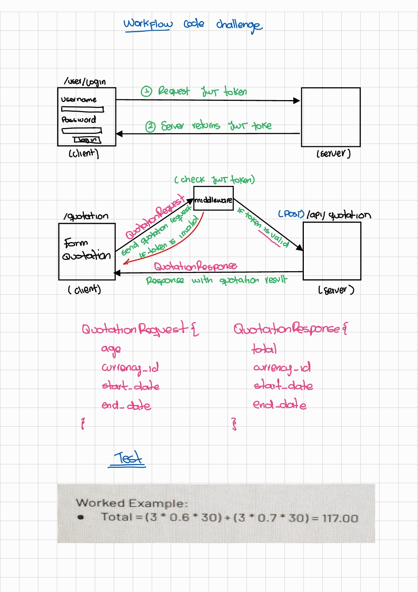

# Test Full Stack Developer

This repository contains code of the assessment for a full-stack developer position.

## Installation process

- Start app server and database with laravel sail: `./vendor/bin/sail up -d`
- Generate JWT secret key: `./vendor/bin/sail artisan jwt:secret`
- Generate certificate for JWT: `./vendor/bin/sail artisan jwt:generate-certs`
- Run migrations: `./vendor/bin/sail artisan migrate`
- Run fronted app `./vendor/bin/sail npm install && ./vendor/bin/sail npm run build`

## Flow design

## License

The Laravel framework is open-sourced software licensed under the [MIT license](https://opensource.org/licenses/MIT).
